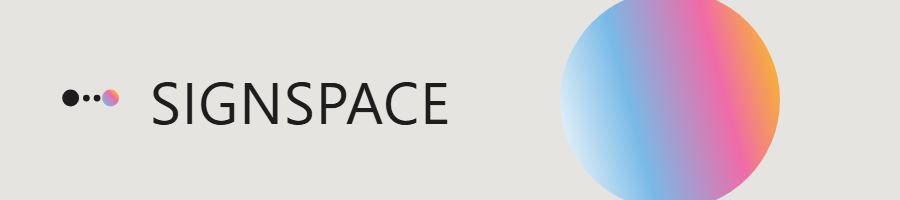
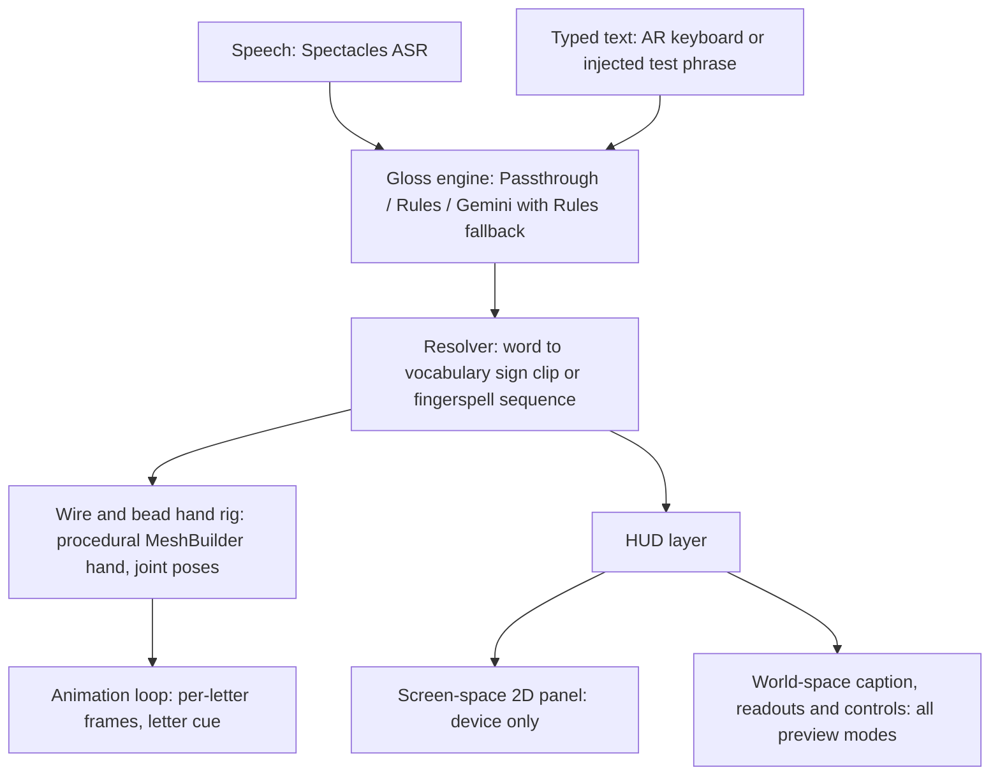

# SignSpace

## What it is

SignSpace is a Spectacles AR lens that turns speech or typed English into animated
American Sign Language. A stylized wire-and-bead hand signs whole vocabulary words,
and fingerspells anything unknown letter by letter, so it never fails to convey a
message. The use case is making sign language visible and interactive for hearing
audiences — demos, classrooms, events — and meeting deaf accessibility halfway.

## Key features

- Live speech input through the Spectacles ASR module, plus typed input from the AR
  keyboard or an injected test phrase.
- Vocabulary signs — HELLO, THANK YOU, I LOVE YOU, MORE, WATER, SORRY, PLEASE, YES —
  with automatic fingerspell fallback for anything unknown.
- A letter cue showing the current letter during fingerspelling.
- Floating world-space readouts: the heard text, the ASL gloss, and the token stream
  where `*` marks a whole sign and `+` marks fingerspell — plus tappable vocabulary
  and MIC / gloss-mode controls: Passthrough, Rules, Gemini.
- A screen-space 2D panel on device.
- Gloss modes where Gemini falls back to Rules until a RemoteServiceGateway token is
  wired.

## Architecture



## How it should look

**On device (and in non-stereo previews)** the 2D panel anchors to the top-left of
your view: a dark translucent glass card about a quarter of the screen wide, with,
top to bottom: the **HandGloss** title, a blue `heard: …` line (live speech or typed
text), a green `ASL: …` gloss line, an amber `gloss: …` token line (`*` = whole
sign, `+` = fingerspell), and a grid of tappable vocabulary buttons with an ENV
toggle. A large amber letter cue sits at the bottom-right of the view during
fingerspelling.

**In every view** (including the desktop stereo preview) the hand floats at the
center of your space, with a live gloss caption directly under it, the floating
readouts (title, heard, ASL, tokens) to the left, tappable vocabulary words beneath
them, and a `[ MIC ]  PASSTHROUGH  RULES  GEMINI` control row. `submission-demo.mp4`
shows exactly this composition with the narration track.

Because of the stereo-preview limitation below, reviewers should judge the panel
itself on device (or a mobile preview) and the hand/caption/controls in the desktop
preview.

## Honest preview limits

- The SPECS 27 stereo desktop preview in Lens Studio 5.23.2 does not render
  screen-space (ScreenTransform) UI. The 2D panel renders on-device and in
  non-stereo previews.
- World-space content — the hand, caption, readouts, controls, and vocab — renders
  everywhere.
- Spectacles Interaction Kit requires the Preview device set to SPECS 27, or
  rendering fails.

## Repo layout

```
Assets/Scripts/        SignSpaceHand, SignSpaceHUD, HandRig
Assets/SignLanguage/   glosser, resolve, signs, fingerspell, pose, handshape, math
CLAD_PROMPT_LOG.md     the full build log
voiceover/             narration script + generated mp3
prompt-b*.txt          the per-round CLAD prompts
ref-*.ts               verbatim-copy reference files
```

The `prompt-b*.txt` and `ref-*.ts` files are kept local: they are the per-round
CLAD prompts and the reference files copied verbatim during each build round.

## How it uses CLAD

SignSpace was built round by round with CLAD prompts, one focused change per round.
Each round ended with evidence checks in the Lens Studio preview — render, play,
and confirm the expected behavior before moving on. The full prompt and
verification history lives in `CLAD_PROMPT_LOG.md`.
